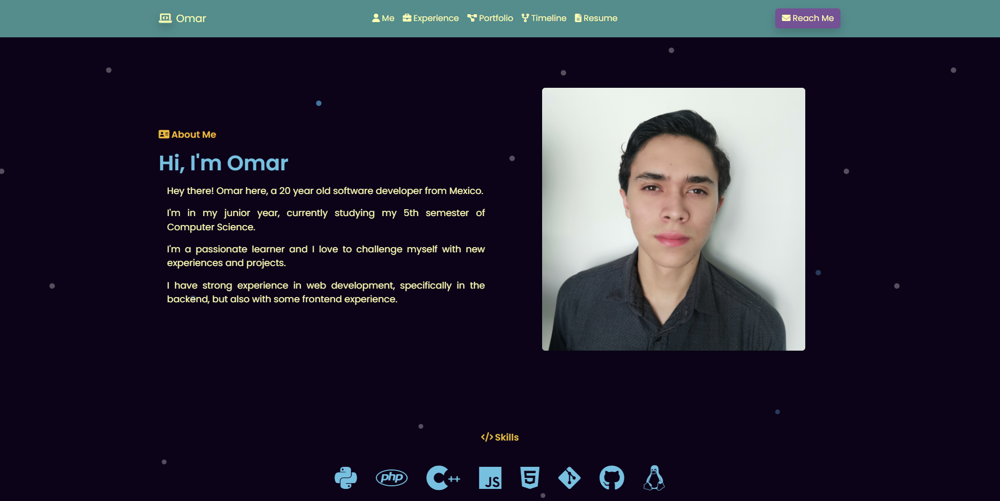

# Portfolio

My own portfolio website, part of my MLH Fellowship experience.

## Table of Contents

- [Portfolio](#portfolio)
  - [Table of Contents](#table-of-contents)
  - [About](#about)
  - [Features](#features)
  - [Technologies](#technologies)
  - [Topics](#topics)

## About

This is my portfolio website, part of the Site Reliability Engineering track at [MLH Fellowship](https://fellowship.mlh.io/) Summer 2023. In this project, I am able to put my skills into practice and learn new ones by exploring what it means to be a Site Reliability Engineer. I am also able to learn about the different tools and technologies that are used in the industry.

The website is deployed on a DigitalOcean droplet using Docker and Nginx. The CI/CD pipeline is implemented using GitHub Actions. And it looks like this:

## Features

- Responsive design
- Home page
- Experience page
- Portfolio page
- Contact information
- Links to resume and social media
- Timeline page with a public blog
- Database for the timeline blog
- Endpoints for the timeline blog
- Dockerized application
- CI/CD pipeline

## Technologies

- Frontend:
  - HTML
  - CSS
  - JavaScript
  - Bootstrap
  - jQuery
- Backend:
  - Python
  - Flask
  - Peewee
  - MySQL
- Server and Deployment:
  - Docker
  - GitHub Actions
  - DigitalOcean
  - Nginx
  - Bash

## Topics

The topics that I have been learning about are:

- Site Reliability Engineering
- Linux
- Virtual Private Servers
- Professional Workflows
- Scripting
- Databases
- Testing
- Containers
- CI/CD
